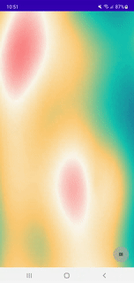
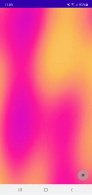

## About this component

Animated Plasma Background is an animated background image that turns your android screen into a
lava lamp. Inspired
by [Slawomir Chodnicki Article](https://towardsdatascience.com/fun-with-html-canvas-lets-make-lava-lamp-plasma-e4b0d89fe778)
this simple Jetpack Compose Component enable you to turn any background into a smooth colorful
animation.




## Howto use

**Step 1. Add the JitPack repository to your build file**

Add it in your root build.gradle at the end of repositories:

```
allprojects {
  repositories {
    ...
    maven { url 'https://jitpack.io' }
  }
}
```

**Step 2. Add the dependency for the component you need**

Every component has it own dependency, so you pick just the components you need and add the dependency in your app/module build.gradle file
```
dependencies {
  implementation 'com.github.VanFanelia:gemischte-tuete-component-library:plasmabackground:0.1.6'
}
```

If you use **maven**, **sbt**, **leiningen** see [HowTo on JitPack.io](https://jitpack.io/#VanFanelia/gemischte-tuete-component-library#howto)


**Step 3. Insert Plasma Background into your composable**

```
PlasmaBackground(
  colors = arrayOf(
      Color(0xFF227c9d),
      Color(0xFF17c3b2),
      Color(0xFFffcb77),
      Color(0xfffef9ef),
      Color(0xfffe6d73)
  ),
)
```

## Configuration

### Change Color
To change the appearance of the background change the `colors`. Its an Array of Colors (from androidx.compose.ui.graphics.Color) and fixed to 5 colors.

If you insert an empty Array the colors are picked from your MaterialTheme settings. The plasma changed between Color.primary <-> Color.background <-> Color.secondary.

### Improve Performance
`maxDPS: Int` If you have performance issues you can limit the FramesPerSeconds (FPS)

### Debug flags
If you have perfomance issues you can debug the plasma background with some flags:

`debugShowFPS: Boolean` renders the current frame rate of drawing into the plasma background

`debugColor: Color` set a debug Color. If you have rendering Issues it shows areas which are not filled with plasma pixels.

`debugDoNotScale: Boolean` for performance improvement the plasma background is rendered only with a height / width of your screen DP. After rendering it is scaled to the size of your composable. If you want to disable the scaling set this flag.


